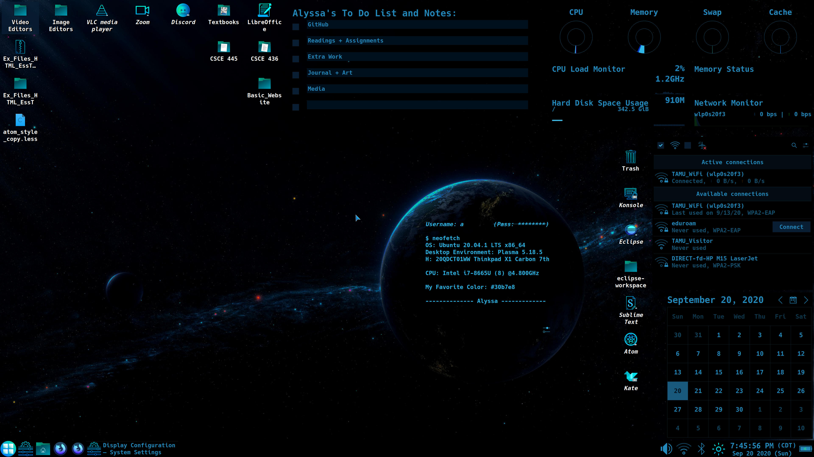

# Desktop-And-Application-Configurations
My Desktop and Application Configurations - Alyssa
Keeping track of my systems, desktops, and applications (configurations, setup, styles...)

### My Systems:
<pre> Lenovo X1 Carbon Gen 7 (***Default System***)
<code>
CPU: Intel i7-8665U (8) @4.800GHz
RAM: 16 GB DDR4 2666MHz
Hard Drive: 1TB HD + 512GB SSD
Dual Boot:
OS1: Ubuntu 20.04.1 LTS x64 - KDE: Plasma
OS2: Windows 10 x64
</code></pre>

<pre> Lenovo Thinkpad T480
<code>
CPU: Intel i7-9750H (9) @4.500GHz
RAM: 16 GB DDR4 2666MHz
Hard Drive: 512GB SSD
OS: Windows 10 x64
</code></pre>

<pre> Raspberry Pi 4
<code>
CPU: ARM Cortex-A72 (8) @1.5GHz
RAM: 8GB LPDDR4-3200 SDRAM
Hard Drive: 64GB SD
OS: Ubuntu 20.04.1 LTS x64 - DE: Gnome
</code></pre>

### Lenovo X1 Carbon Gen 7
<pre>
<code>
OS1: Ubuntu 20.04.1 LTS x64 - KDE: Plasma
Global Theme: Qogir
Plasma Style: Starcraft
Application Style: Breeze
Window Decorations: Plastik
Colors (Custom):
        View Background: #000000
        View Text: #30b7e8
        Window Background: #020c14
        Window Text: #30b7e8
        Button Background: #000000
        Button Text: #30b7e8
        Selection Background: #21657d
        Selection Text: #000000
        Selection Inactive Text: #000000
        Inactive Text: #666a73
        Link Text: #ff4093
        Visited Text: #8a1857
        Negative Text: #da4453
        Neutral Text: #ac8c0b
        Positive Text: #27ae60
        Focus Decoration: #138ec2
        Hover Decoration: #138ec2
        Tooltip Background: #353945
        Toottip Text: #d3dae3
        Active Titlebar: #000000
        Active Titlebar Text: #21657d
        Active Titlebar Secondary: #000000
        Inactive Titlebar: #000000
        Inactive Titlebar Text: #21657d
        Inactive Titlebar Secondary: #000000
Fonts (Custom):
        General: Hack 9pt
        Fixed Width: Hack 10pt
        Small: Hack 9pt
        Toolbar: Hack 10pt
        Menu: Hack 10pt
        Window Title: Hack 9pt
Icons (Custom):
        Default: Breeze-openSUSE Dark
        Additional: Custom Icons
        Sizes:
              Desktop: 48
              Toolbar: 32
              Main Toolbar: 32
              Small Icons: 22
              Panel: 64
              Dialogs: 32
Curser: StarLabs
Display and Monitor: 3840x2160 @225%
Browser: Firefox
        Theme: Dark Aubergine
</code></pre>

